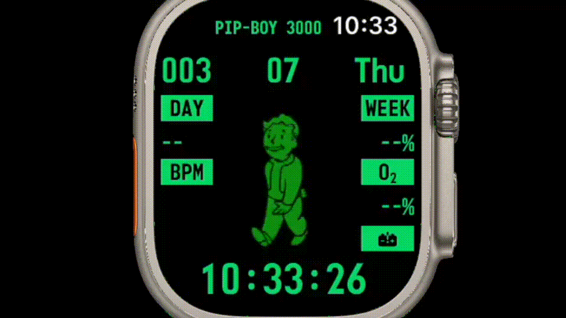
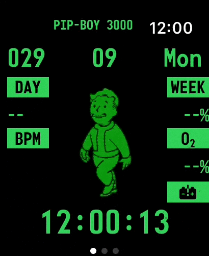

# 🚶‍♂️ FalloutPipBoy Watch App

iOS Apple Watch application that brings three unique watch face themes to your wrist: Fallout Theme, Rotating Seconds, and Back to the Future Theme. 

## 📸 Screenshots

<div align="center">
  
  
</div>

## 🎨 Features

**Fallout Theme**: Inspired by the iconic Pip-Boy from the Fallout series, this watch face features a retro-futuristic green monochrome display with animated elements mimicking the Pip-Boy interface. Perfect for fans of the post-apocalyptic RPG.

**Rotating Seconds**: A minimalist and dynamic watch face where the seconds hand rotates smoothly around a sleek, modern design. Ideal for those who prefer a clean, functional aesthetic with a focus on timekeeping precision.

**Back to the Future Theme**: Channel the spirit of the DeLorean with this theme, featuring a digital flux capacitor-inspired display and time-travel animations. A nostalgic tribute to the classic sci-fi movie trilogy.

**HealthKit Integration**: Seamlessly integrates with HealthKit to display health and fitness data (e.g., steps, heart rate) in the context of each theme.

## 🛠 Tech Stack

* **Swift 6.0+** - Latest Swift language features and concurrency model
* **SwiftUI** - Modern declarative UI framework
* **Swift Concurrency** - Async/await, actors, and structured concurrency
* **WatchOS & WatchKit** - Apple Watch companion app framework
* **HealthKit** - Health and fitness data integration
* **MainActor** - Thread-safe UI updates with actor isolation

## 🏗 Project Structure
```bash
FalloutPipBoy/
 Sources/
 ├── App/                       # Apple Watch companion app
 │
 ├── Core/
 │    ├── Services/             # HealthKit, Task management
 │    └── Utils/                # Helpers, Extensions, Sendable types
 │
 ├── Features/
 │    ├── Root/                 # Main Tab View with @MainActor isolation
 │    ├── BackToTheFeature/     # Back to the Future theme with task-based animations
 │    ├── PipBoy/               # Fallout theme, preferences with Swift 6 concurrency
 │    └── RotatingSeconds/      # Rotating Seconds theme using modern async timers
 │
 ├── Resources/
 │    ├── Assets.xcassets       # Image assets for watch faces
 │    └── Fonts                 # Custom fonts for themed displays
 │
 └── Tests/
      ├── UnitTests/            # Unit tests for core functionality
      └── UITests/              # UI tests for watch face rendering
```

## 🚀 Installation

### Prerequisites

* **Xcode 16** or later (Swift 6 support required)
* **Apple Watch** (watchOS 11 or later recommended)
* **iOS 18** or later for the companion app (Swift 6 compatibility)

### Steps

1. **Clone the repository**
```bash
git clone https://github.com/karkadi/FalloutPipBoy.git
cd FalloutPipBoy
```

2. **Open in Xcode 16+** - The project uses Swift 6 language features

3. **Enable required Capabilities**:
   - Workout processing
   - HealthKit

4. **Build Requirements**:
   - Swift 6 language mode enabled
   - Strict concurrency checking set to "Complete"
   - MainActor isolation for all UI components

## 🔄 Migration to Swift 6

This project has been fully migrated to Swift 6 with the following key changes:

### Concurrency Updates:
- **@MainActor** isolation for all view models and UI components
- **Async/await** replacing Combine publishers for timers and animations
- **Sendable** compliance for cross-actor data types
- **Structured concurrency** with proper task cancellation
- **Actor isolation** for thread-safe state management

## 📋 Roadmap

- [ ] **Swift 6 Migration Complete** ✅
- [ ] Add complications for each theme (e.g., step count, heart rate, weather)
- [ ] Support for additional watch face animations and transitions
- [ ] Improve accessibility features (e.g., high-contrast modes)
- [ ] Introduce new themes based on user feedback (e.g., Star Wars, Cyberpunk)
- [ ] Add support for dynamic complications based on calendar events or notifications
- [ ] Optimize performance for older Apple Watch models
- [ ] Implement iCloud syncing for user preferences across devices

## 🤝 Contribution

Pull requests are welcome! For major changes, please open an issue first to discuss what you'd like to change.

**Development Requirements**:
- Code must comply with Swift 6 concurrency rules
- Use @MainActor for all UI-related code
- Prefer async/await over Combine where appropriate
- Ensure proper task cancellation in deinitializers

## 📄 License

This project is licensed under the MIT License.
See [LICENSE](LICENSE) for details.
